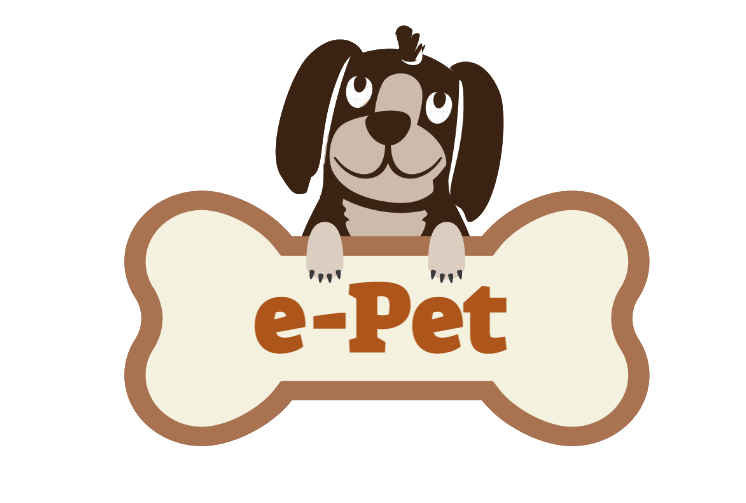

# e-PET Software

> *A software for pet owners and veterinarians to keep track of the pets!*

This repository holds the source code of the e-Pet software that is created as a project for the CS 320 (Software Engineering) course in Ozyegin University, Istanbul, Turkey.

<br />
<p align="center">
    
  </a>
</p>

<p> </p>

[](https://github.com/durmusberk/cs320_project/actions/workflows/python-app.yml)

### Technical Details

The software is completely developed using Python 3. For the graphical user interface (GUI), PyQt5 library is used. The main design of the appearance is made with Qt Designer. After that, the *.ui* files are converted into *.py* files and rearranged for implementing the details.

The database named *epet_database.db* keeps the entire software data in 6 different tables which are;

* *user:* Keeps both the pet owners, and the veterinarian information.
* *pet:* Keeps the pet information.
* *appointment:* Keeps the appointment information of the veterinarian for the specific pets.
* *treatment:* Keeps the treatment records of the pets.
* *vaccination:* Keeps the vaccination records of the pets.
* *allergy:* Keeps the allergy records of the pets.

The rows of the database is created by combining random data in *db_initialize.py* file.

### Requirements

* Install all the libraries in the *requirements.txt* file.

### Instructions

To run the software, open terminal, go to the main directory of the project, and run:

```sh
$ python main.py
```

To log in to the system, user need to enter an ID, and a password. The user can be either a pet owner, or a veterinarian. The information of the users are kept in the database as an encrypted format. For testing purposes, these id-password pairs can be used to log in:

* **Pet owner:**
  * *User ID:* 10824441638
  * *Password:* tyortiz123
* **Veterinarian:**
  * *User ID:* 11727904499
  * *Password:* ikeeastman123

## Application ScreenShots


## Contact

[](mailto:metin.arkanoz@ozu.edu.tr)

[](mailto:atahan.caldir@ozu.edu.tr)

[](mailto:durmus.berk@ozu.edu.tr)

[](mailto:selim.cavas@ozu.edu.tr)

[](mailto:cansu.celik@ozu.edu.trk)
